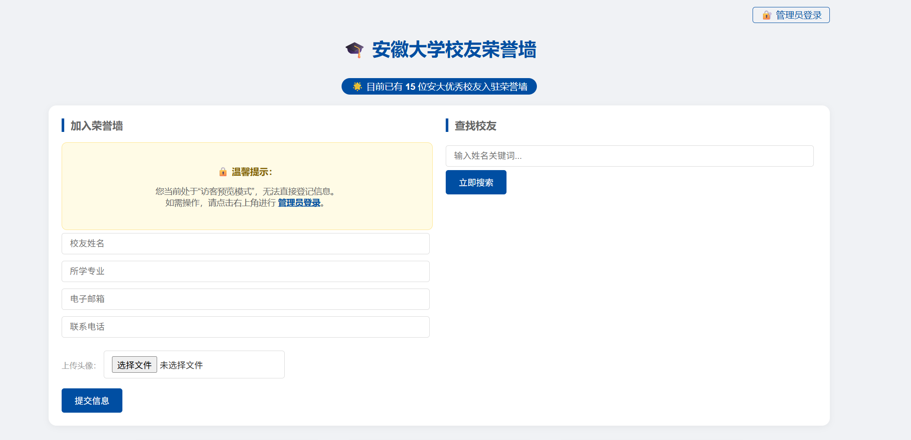
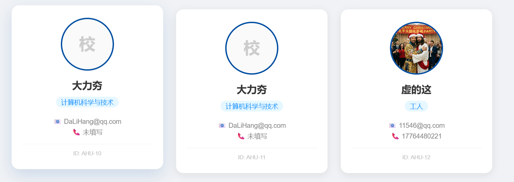
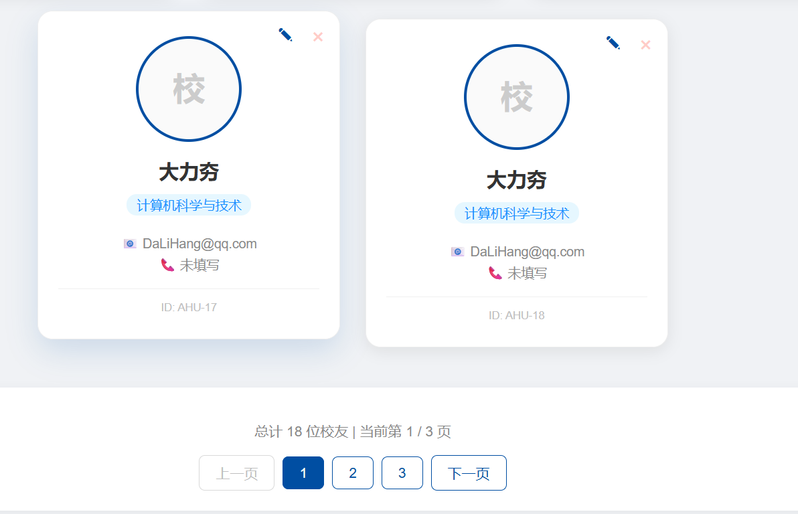

# 🎓 AHU Alumni Honor Wall (High Performance Edition)

这是一个为安徽大学校友信息管理定制的 Spring Boot 应用。本项目在第一阶段已通过 **Redis 分布式缓存** 与 **MyBatis-Plus 物理分页** 技术完成了核心性能重构。






## 🚀 第一阶段重构特性 (Phase 1)

* **高性能统计**: 利用 **Redis 旁路缓存 (Cache-Aside)** 存储校友总数，实现 O(1) 级别的极速响应，大幅降低数据库压力。
* **搜索结果秒开**: 搜索结果通过 **Jackson 序列化为 JSON** 缓存于 Redis 中，支持热门关键词的内存级检索。
* **企业级物理分页**: 基于 **MyBatis-Plus 拦截器** 实现真正的 LIMIT 分页，避免大数量级下的内存溢出。
* **规范化图片管理**: 采用 **UUID 重命名机制** 存储头像，防止文件名冲突，并支持 D 盘物理路径的虚拟映射。
* **容器化开发环境**: 全量中间件（Redis）采用 **Docker + WSL 2** 部署，实现生产级的环境隔离。

## 🛠️ 技术栈

* **核心框架**: Spring Boot 3.x, Java 17。
* **持久层**: **MyBatis-Plus 3.5.x** (ORM & Pagination)。
* **中间件**: **Redis** (Docker 容器化部署)。
* **数据序列化**: Jackson (ObjectMapper & TypeReference)。
* **前端模板**: Thymeleaf & CSS3 (Flexbox/Grid 响应式布局)。

## 🏗️ 快速开始

### 1. 启动 Redis 容器
确保你的电脑已安装 Docker，在终端运行以下命令：
```bash
docker run -d --name ahu-redis -p 6379:6379 redis